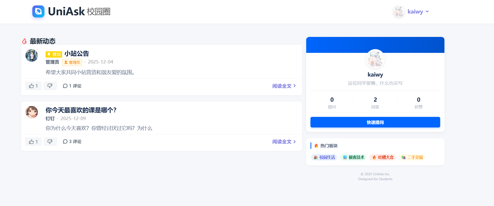

# 🎓 UniAsk 校园圈 (Campus QA System)

> **一个基于 Flask + MongoDB 构建的轻量级、垂直化校园问答社区系统。**
> 
> A lightweight, vertical campus Q&A community built with Flask and MongoDB.

   

## 📖 项目简介

**UniAsk** 旨在解决高校内部信息检索困难、交流渠道分散的痛点。区别于传统的论坛系统，本项目采用 **非关系型数据库 (NoSQL)** 应对多变的社区字段需求，并结合 **服务端渲染 (SSR)** 与 **AJAX 异步交互**，打造了极致流畅的用户体验。

系统集成了用户认证、即时问答、互动评价、个人中心及完善的后台管理机制，是一个功能闭环、架构清晰的 Web 全栈项目。

## ✨ 核心特性

### 🛡️ 安全与权限 (Security & RBAC)
- **双重熔断机制**：发布内容时，前端进行格式校验，后端 `MongoUtil` 层进行封禁状态检测，从根源拦截违规用户。
- **自动化运维**：系统启动时自动检测并修复管理员账号权限 (`_init_admin`)，实现“开箱即用”。
- **数据安全**：全站 HTTPS 传输（Caddy 反代），密码采用加盐哈希存储。

### ⚡ 极致体验 (User Experience)
- **无刷新预览**：头像上传采用 `FileReader` 实现本地即时预览，配合前端 300KB 大小预拦截，拒绝无效请求。
- **紧凑型 UI**：基于 Spectre.css 定制的紧凑布局，配合全局微缩放设计，呈现“精品 App”般的视觉质感。
- **智能排序**：首页内容基于“置顶权重 + 时间倒序”的聚合算法，确保重要通告不被淹没。

### 🧩 技术架构 (Architecture)
- **DAO 设计模式**：通过 `MongoUtil` 类封装所有数据库操作，实现业务逻辑与数据访问的彻底解耦。
- **文档型数据模型**：利用 MongoDB 的 BSON 特性，将“点赞列表”内嵌于文档中，避免了传统 SQL 的多表 JOIN，查询效率极高。

## 🛠️ 技术栈

*   **后端框架**: Python Flask
*   **数据库**: MongoDB (PyMongo驱动)
*   **前端界面**: Jinja2 模板 + Spectre.css (轻量级UI库) + jQuery
*   **服务器**: Gunicorn (WSGI容器) + Caddy (反向代理/自动HTTPS)
*   **图像处理**: Werkzeug (安全文件名) + 前端二进制流校验

## 📂 项目结构

```text
qa_system/
├── main.py                     # Flask 主程序入口、路由分发
├── your_code_here/             # 后端业务逻辑包
│   ├── __init__.py
│   └── MongoUtil.py            # [核心] DAO层、聚合查询、熔断逻辑
├── static/                     # 静态资源
│   ├── css/                    # Spectre.css & RemixIcon
│   ├── js/                     # jQuery
│   └── uploads/                # 用户头像存储
├── templates/                  # 前端模板
│   ├── layout.html             # 全局母板
│   ├── index.html              # 首页
│   ├── answer_list.html        # 详情页
│   ├── profile.html            # 个人设置页
│   └── ...
├── fix_admin.py                # 管理员权限修复脚本
└── requirements.txt            # 项目依赖
```

## 🚀 快速开始 (本地开发)

### 1. 克隆项目
```bash
git clone https://github.com/lixongchuan/qa_system.git
```

### 2. 环境配置
建议使用虚拟环境：
```bash
python -m venv venv
# Windows
venv\Scripts\activate
# Linux/Mac
source venv/bin/activate
```

### 3. 安装依赖
```bash
pip install -r requirements.txt
```

### 4. 配置数据库
打开 `your_code_here/MongoUtil.py`，修改 MongoDB 连接字符串：
```python
self.client = pymongo.MongoClient("mongodb://账号:密码@IP:端口/")
```

### 5. 运行项目
```bash
python main.py
```
访问 `http://127.0.0.1:5000` 即可看到系统运行。
*默认管理员账号*：`admin@quest.bupang.xyz` / 密码 `admin` (系统启动后自动创建)

## 🌐 生产环境部署

推荐使用 **Linux + Gunicorn + Caddy** 的组合：

1.  **启动 Gunicorn 服务**：
    ```bash
    gunicorn -w 4 -b 0.0.0.0:8700 main:app
    ```
2.  **配置 Systemd 守护进程**：
    确保服务在后台稳定运行并开机自启。
3.  **配置 Caddy 反向代理**：
    ```caddyfile
    quest.bupang.xyz {
        reverse_proxy 127.0.0.1:8700
    }
    ```
    Caddy 会自动申请并续期 SSL 证书。

## 📸 界面截图

### 📷 界面截图

| 首页 (Home) | 详情页 (Detail) |
|:---:|:---:|
|  |  |

| 个人中心 (Profile) | 移动端适配 (Mobile) |
|:---:|:---:|
|  | *(在此处放置移动端截图)* |

## 📄 版权说明

本项目采用 [MIT License](LICENSE) 开源协议。
Designed & Developed by **[lixongchuan]**. 

---
*Made with ❤️ for Students.*

---
